# AWS Architecture Diagram - Medici Assessment

## Visual Architecture

```mermaid
graph TB
    subgraph internet["🌐 Internet"]
        users["👥 Users"]
    end
    
    subgraph aws["AWS Region: eu-west-1"]
        subgraph vpc["VPC 10.0.0.0/16"]
            igw["🚪 Internet Gateway"]
            
            subgraph public["📍 Public Subnets"]
                ps1["Public Subnet 1<br/>10.0.1.0/24"]
                ps2["Public Subnet 2<br/>10.0.2.0/24"]
                ec2["💻 EC2 Instance<br/>t3.micro<br/>Amazon Linux 2"]
                docker["🐳 Docker<br/>Nginx<br/>Port 80"]
            end
            
            nat["🔄 NAT Gateway"]
            
            subgraph private["🔒 Private Subnets"]
                priv1["Private Subnet 1<br/>10.0.10.0/24"]
                priv2["Private Subnet 2<br/>10.0.11.0/24"]
                rds1["🗄️ RDS MySQL<br/>Primary"]
                rds2["🗄️ RDS MySQL<br/>Standby"]
            end
        end
        
        subgraph services["☁️ AWS Services"]
            ecr["📦 ECR Repository<br/>medici-assessment-ecr"]
            cw["📊 CloudWatch<br/>Monitoring"]
        end
    end
    
    subgraph cicd["🔄 CI/CD Pipeline"]
        gh["🐙 GitHub<br/>Repository"]
        gha["⚙️ GitHub Actions<br/>Workflow"]
        build["🔨 Build<br/>Docker Image"]
        approve["✅ Manual<br/>Approval"]
        deploy["🚀 Deploy<br/>to EC2"]
    end
    
    users -->|HTTP 80| igw
    igw --> ps1
    igw --> ps2
    ps1 --> ec2
    ps2 --> ec2
    ec2 --> docker
    docker --> nat
    nat --> priv1
    nat --> priv2
    priv1 --> rds1
    priv2 --> rds2
    rds1 -.->|Sync| rds2
    
    gh -->|Push| gha
    gha --> build
    build --> ecr
    ecr --> approve
    approve --> deploy
    deploy -->|Pull| ec2
    
    ec2 -.->|Logs| cw
    rds1 -.->|Logs| cw
    
    style vpc fill:#e1f5ff
    style public fill:#c8e6c9
    style private fill:#ffccbc
    style services fill:#f3e5f5
    style cicd fill:#fff9c4
    style internet fill:#eeeeee
```

## Architecture Components

### 🌐 Internet Layer
Users access the application via HTTP on port 80

### 🏗️ VPC Architecture
VPC CIDR: 10.0.0.0/16
Internet Gateway: Routes traffic from internet to public subnets

### 📍 Public Subnets (2 AZs)
Subnet 1: 10.0.1.0/24 (eu-west-1a)
Subnet 2: 10.0.2.0/24 (eu-west-1b)
Contains EC2 instance running Docker/Nginx
Accessible from internet

### 💻 Compute Layer
EC2 Instance: t3.micro (Amazon Linux 2)
Docker Container: Nginx web server
Port: 80 (HTTP)
Serves the Medici Assessment webpage

### 🔄 NAT Gateway
Allows private subnets to reach internet
Provides outbound internet access for RDS and other services

### 🔒 Private Subnets (2 AZs)
Subnet 1: 10.0.10.0/24 (eu-west-1a)
Subnet 2: 10.0.11.0/24 (eu-west-1b)
Contains RDS database instances
NOT accessible from internet

### 🗄️ Database Layer
RDS MySQL: db.t3.micro
Primary Instance: Active in Subnet 1
Standby Instance: Failover in Subnet 2
Multi-AZ: Automatic failover capability
Port: 3306 (MySQL)
Database: devopsdb

### ☁️ AWS Services
ECR Repository: Stores Docker images
CloudWatch: Monitoring, logs, and alerts

### 🔄 CI/CD Pipeline
1. GitHub: Source code repository
2. GitHub Actions: Triggered on code push
3. Build Stage: Docker image built
4. ECR: Image pushed to registry
5. Manual Approval: Human approval required
6. Deploy Stage: Image deployed to EC2
7. EC2: Pulls and runs new image

## Data Flow
Users → Internet Gateway → Public Subnet → EC2 → Docker Container → Nginx
                                            ↓
                                        NAT Gateway
                                            ↓
                                      Private Subnet
                                            ↓
                                      RDS MySQL

## Security Architecture

### Security Groups
EC2 Security Group:
- Inbound: HTTP (80), HTTPS (443), SSH (22)
- Outbound: All traffic

RDS Security Group:
- Inbound: MySQL (3306) from EC2 only
- Outbound: All traffic

### Network Isolation
- Public subnets: Internet accessible
- Private subnets: Internet isolated
- RDS: Only accessible from EC2

## High Availability
- Multi-AZ RDS: Automatic failover between AZs
- Automated Backups: 7-day retention
- Health Monitoring: CloudWatch alerts
- Disaster Recovery: Infrastructure as Code for quick redeployment

## Cost Optimization
- Free Tier: EC2 t3.micro and RDS db.t3.micro
- Estimated Cost: 35-50/month
- NAT Gateway: ~32/month
- Data Transfer: Minimal within VPC
